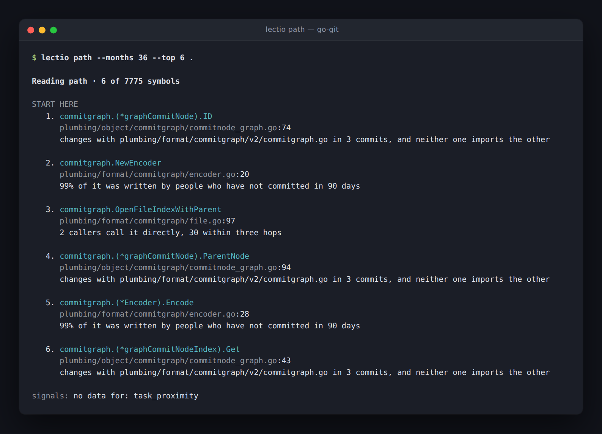
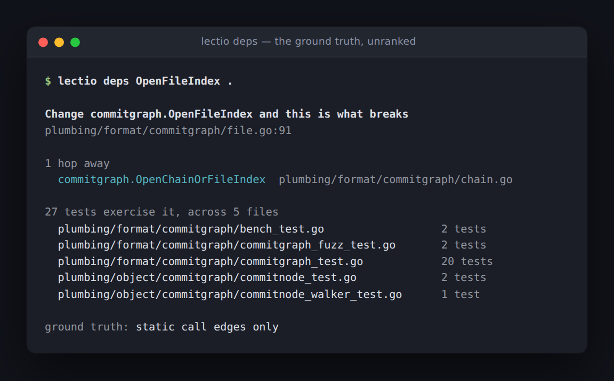
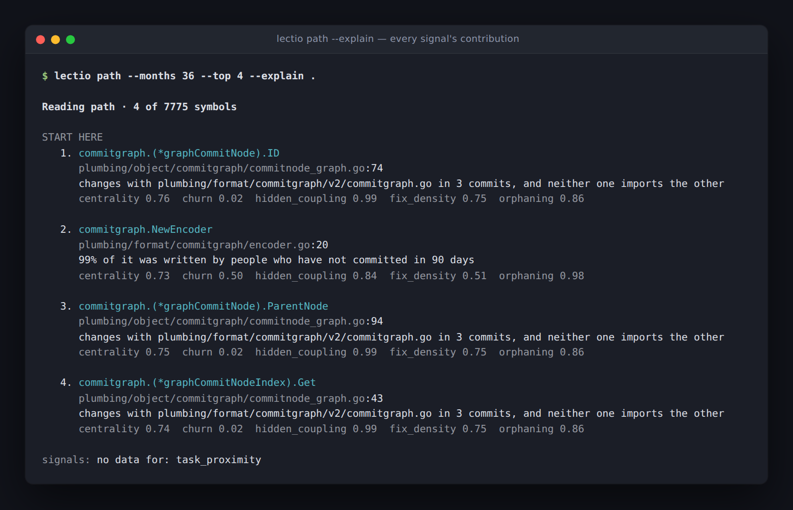
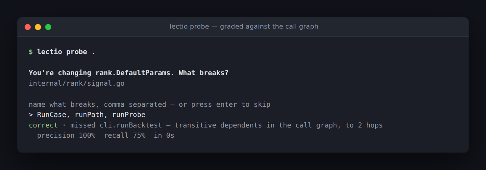

# Lectio

**Codebase orientation for new hires.** Point it at a repo you just joined. It
tells you what to read, in what order, and why — and later, where your
understanding is actually thin.



Three different signals lead those reasons: hidden coupling, orphaning,
centrality. A list where every row said the same thing would mean six of the
seven signals were decoration.

> **Status: Gate A failed, eleven ways, across two corpora.** Across 30 pinned
> repositories, lectio lost to *largest files* — and once file size is held
> constant the two are the same strategy. Hidden coupling, the differentiator,
> measures a lift of 1.02 over 2,311 newcomer corrective commits: no
> relationship. Grading declarations instead of files removed the file-size
> prior and a control that ranks the longest declarations beat the ranking two
> to one. With size removed by construction — each touched declaration paired
> against one of the same size — every strategy scores chance, and that holds at
> every pairing bound down to *identical* length: 2,496 pairs, 24 repositories,
> nothing above 51.4%. A second corpus of thirty repositories that produced none
> of these hypotheses killed four of the five that were tested on it. Full
> result: [docs/gate-a-2026-08.md](docs/gate-a-2026-08.md). See
> [Where this stands](#where-this-stands).
>
> The reading path below is what the tool produces today. It is not evidence
> that the ordering is right, and this repository has never claimed otherwise.

> Every screenshot below is a real run, captured from a terminal — against
> [go-git](https://github.com/go-git/go-git) (7,775 symbols, 36,615 call edges)
> unless noted. None of them are mockups, including the one that says FAIL.

## The one load-bearing rule

**The LLM never grades.** It may write question stems and one-line rationales.
Every correctness judgment comes from the call graph, the test suite, or git
history.

That constraint is structural, not aspirational. The only seam where a model
can be wired in is `probe.StemWriter`, which receives a symbol and returns a
string — it cannot see the expected answer set, cannot modify it, and runs
before grading exists. The type will not permit a phrasing, however creative,
to influence whether an answer is judged correct.

The same discipline shows up in the two call graphs. `View.Calls` includes
edges that class-hierarchy analysis over-approximated and drives ranking, where
a *possible* caller is still a reason to read something. `View.StaticCalls`
holds only edges the type checker proved and drives grading, so nobody is ever
marked wrong for failing to name a call no execution reaches.

You can read the same ground truth the grader does, and disagree with it:



The footer states its provenance, because a grader that cannot say why it
marked something wrong is one nobody will believe twice.

## What it is not

Not a metric product. A comprehension score exists internally to order the
reading path. It is never the headline, it is never displayed as a grade, and
it never leaves your machine. `lectio probe --forget` erases it in one command.

## Install

```sh
go install github.com/EzraStone/Lectio/cmd/lectio@latest
```

Requires Go 1.24+ and `git` on PATH. The binary is static — the SQLite driver
is pure Go, so there is no cgo and nothing to link.

`lectio version` prints the Go release it was built with, which is the first
thing to check if a reading path looks wrong.

```sh
cd ~/src/some-go-repo
lectio index .        # analyze; writes .lectio/index.db
lectio path .         # what to read, in what order, and why
```

Build `lectio` with a Go release at least as new as the repository you point it
at. The type checker is compiled in, so an older binary cannot type-check a
newer language version — it will index anyway, warn that packages failed, and
produce a call graph missing everything in them.

## Commands

| Command | What it does |
| --- | --- |
| `lectio index [repo]` | Analyze a repository and build its index |
| `lectio path [repo]` | Print a reading path, with a reason per item |
| `lectio deps <symbol> [repo]` | What breaks if you change this |
| `lectio probe [repo]` | Answer a question, graded against ground truth |
| `lectio backtest [repo...]` | Gate A: predict what a past newcomer touched |
| `lectio backtest --coupling` | Gate A's other half: does hidden coupling predict anything |
| `lectio corpus <status\|pin\|fetch>` | Manage the thirty repositories Gate A runs against |
| `lectio compare <a.json> <b.json>` | Two runs side by side, if they are comparable |
| `lectio version` | Version, and the Go release the analysis is capped by |

Useful flags:

```sh
lectio path --task billing        # scope to the area you are working in
lectio path --explain             # show every signal's contribution
lectio path --json                # machine-readable, stdout stays clean
lectio deps parseInterval --uses  # what it depends on, instead
lectio index --run-tests          # map tests to symbols (executes repo code)
lectio probe --health             # is the probe design working?
lectio probe --forget             # erase all local history
lectio backtest --ablate          # what each signal is worth, in points
lectio backtest --collapse max    # the symbol-to-file rule; mean by default
lectio backtest --target corrected  # grade against what they had to fix
lectio backtest --target symbols  # grade declarations, not file paths
lectio backtest --coupling        # the second backtest: does the differentiator work?
lectio backtest --candidates      # score the named candidate weightings
lectio backtest --workers 4       # cases in parallel; each type-checks a repo
lectio version                    # and which Go release caps the analysis
```

Two runs are only comparable when their case-set fingerprints match — which
cases survive depends on whether each rewound revision's dependencies
resolved, so the same command can score 85 cases one day and 77 the next.
`lectio compare` checks that before showing any deltas, and refuses rather than
printing numbers with a caveat attached.

The index lives in `.lectio/index.db` inside the repo. Add `.lectio/` to your
global gitignore.

## The seven signals

Each normalizes to [0,1] and is separable, so a ranking can be taken apart and
argued with — which is the only way to answer whether it is any good.

| Signal | Source | Why it matters |
| --- | --- | --- |
| Centrality | PageRank on the call graph | High fan-in means you can't avoid it |
| Churn | Commits touching the file, 12mo | Hot code is code you'll be asked to change |
| **Hidden coupling** | **Co-change minus static dependency** | **Files that change together without importing each other** |
| Fix density | Commits matching fix / bug / revert | Where the tricky semantics live |
| Orphaning | Lines whose author is 90d inactive | Nobody left to ask |
| AI density | git-ai notes and assistant trailers | Code that may never have been understood |
| Task proximity | Graph distance from a named area | Optional, user-supplied scope |

**Hidden coupling was the differentiator, and it did not survive contact with
the corpus.** The claim: centrality and churn are computable by anyone, while
co-change without a static dependency surfaces what a senior engineer knows and
cannot articulate — touch the serializer, update the mobile schema.

Measured directly, it finds 1,554 such pairs across 29 repositories and they
have **no relationship to where newcomers go wrong**: a lift of 1.02 over 2,311
corrective commits, against those same newcomers' base rate.


<sub>The ten largest repositories in the corpus. Pooled lift 1.00 — the signal
finds real pairs, and corrective work does not concentrate on them.</sub>

The two guards work as designed. Commits touching more than twenty files are
ignored — a reformat generates pairs quadratically while ordinary commits
generate a few — and strength is the Jaccard index rather than a raw count, so
a file that changes constantly does not look coupled to everything it overlaps.
The pairs are real. What is missing is the connection between them and anything
a newcomer needed.

`--explain` opens up the arithmetic, which is the point of keeping the signals
separable — you cannot argue with a number you cannot decompose:



### Ordering is not ranking

Relevance decides *what* is on the list. Dependency depth decides *the order
you meet it in*, because you cannot understand a handler before its core types.
Results bucket into three relevance tiers, then sort by depth within each tier
— so depth has authority over items of comparable importance and none across
them. The top-scoring item is frequently not the first thing to read.

## Probes

Three types, all gradable without a judge.

- **Blast radius** — *You're changing `parseInterval`. What breaks?* Scored F1
  against the real dependent set plus covering tests. Subjects with fewer than
  two or more than twelve dependents are declined rather than asked badly.
- **Locate** — *Which function handles this?* Distractors come from the
  subject's own package, or the question is answerable by elimination.
- **Direction** — *Does `Scheduler` call `Queue`, or the reverse?* Catches an
  inverted mental model, which is what produces bad architecture decisions
  months later.



<sub>Lectio indexing itself. The grade is F1 against the call graph — no model
is involved in deciding whether that answer was right.</sub>

Firing rules: on first modification of a symbol not previously engaged, at most
three a day, seven-day cooldown per symbol, always skippable. **A skip is
neutral, never a failure** — it never touches the accuracy counters, so
skipping is never cheaper than answering.

`lectio probe --health` checks the spec's own stopping rule: if the median
answer time passes 30 seconds, the probe design is wrong. That is reported as a
defect in this tool, in those words.

## Where this stands

Phases 0 through 3 are built. Gate A has been run at scale eleven times, across
two disjoint corpora, and **failed every time**. The first corpus is 30 pinned
repositories, 114 cases attempted, 85 scored; the second is 30 more that
produced none of the hypotheses tested on it.

| Strategy | precision@10 |
| --- | --- |
| largest files | **48.1%** |
| size-proportional draw *(control)* | 44.1% |
| lectio | 41.9% |
| most churned, 12mo | 41.5% |
| most distinct authors | 41.1% |
| most recently modified | 40.2% |

A random draw weighted by file size outscores the seven-signal ranking. It is a
control rather than a baseline and does not decide the gate, but it is the most
informative row in the table.


The first run at scale left two readings open — the ranking is not good enough,
or the metric rewards size and a size baseline wins by construction. Ten more
runs closed that fork, and not in the ranking's favour.

**The harness had a size bias of its own.** The backtest ranks symbols and
scores files, and the rule bridging them took each file at its best symbol — so
a file with sixty symbols got sixty chances to place high. Removing it cost
lectio 1.3 points. The bias had been helping lectio, which was quietly
borrowing from the baseline it lost to.

**Size-stratified precision found no artifact.** Splitting the same cases into
size quartiles, lectio wins no band. In the two bands where size is genuinely
controlled the gap is 0.2 and 0.3 points — so the ranking is not making worse
choices than a size heuristic, it is making the *same* ones.

**The spec's own tiebreaker fails harder.** Scored against the files newcomers
had to fix or revert rather than the ones they touched, lectio drops to 28.5%
and loses to three baselines instead of one.

**And the differentiator is null.** Hidden coupling, tested directly rather than
through precision@10: lift 1.02 across 2,311 newcomer corrective commits. The
signal finds 1,554 real pairs; corrective work does not concentrate on them.

The weights are unchanged from before all ten runs, and should stay that way.
Every strategy that beat lectio beat it by being more size-correlated, so
fitting to this metric produces a tool that recommends big files — the failure
it exists to prevent.

**And the unit was not the problem either.** Grading declarations instead of
file paths removes the size prior every file-level measure carries — it was the
last explanation under which the ranking might be better than it measured.
Lectio beats all four baselines there, which passes the gate as written, and a
control that simply ranks the longest declarations beats *it* by more than two
to one:

| Strategy | precision@10 on declarations |
| --- | --- |
| largest symbols *(control)* | **22.8%** |
| lectio | 10.5% |
| most churned, 12mo | 8.3% |
| largest files | 6.9% |
| most distinct authors | 6.5% |
| most recently modified | 4.7% |

The control leads on recall, MRR and median too. It was defined before the run,
precisely to ask whether size would follow the measure down from files to
symbols. It did.


<sub>The verdict is a pass. It is printed in warning colour because a control
more than doubled it, which is the more useful fact.</sub>

**And with size removed entirely, nothing predicts anything.** Stratification
narrows a band's size range; it does not eliminate it. Matched pairs do — each
declaration the contributor touched is paired with one of the *same size* they
did not, so a strategy ranking purely by size wins exactly half. Chance is 50%,
which makes the column readable with no baseline beside it:

| Strategy | precision@10 | size-matched |
| --- | --- | --- |
| largest symbols *(control)* | 22.8% | 52.0% |
| lectio | 10.5% | 49.5% |
| most churned, 12mo | 8.3% | 49.9% |
| largest files | 6.9% | 48.4% |
| most recently modified | 4.7% | 49.2% |


<sub>The precision column and the matched column disagree completely, which is
the finding: everything precision@10 rewards, a size-matched pair removes.</sub>

2,891 pairs from 67 cases, every strategy within its own interval of chance.

At file granularity the same instrument is not flat: all three history-derived
baselines sit above chance and both size-derived strategies sit on it. That
split, and four other hypotheses named in code before anything ran, went to a
second corpus — thirty repositories that had produced none of the numbers
above.

**One of the five survived, and it was not a weighting.**

| Hypothesis | gate-a | holdout | Survived? |
| --- | --- | --- | --- |
| history beats size on matched pairs | yes | yes | **yes** |
| removing orphaning is worth +3 pp | +3.0 | −0.1 | no |
| churn is the best single signal | 55.8% | 56.7% | beaten by recency |
| recency is the best predictor | 53.5% | **59.2%** | **yes** |

"Most recently modified" is one of the four baselines. It is not one of the
seven signals. The best available predictor of which of two equally-sized files
a newcomer touches is simply which one was edited last — 3.9 points clear of
the full ranking, on a corpus that had no hand in producing the hypothesis.

The orphaning result is the cautionary one. It was the sharpest thing in seven
runs on the first corpus and it is −0.1 points on the second.

A ninth run then put error bars on the first corpus, and they explain it: the
effect is +1.9 points there with a 95% interval of 49.3 – 59.7 against lectio's
48.3 – 57.0. It was never three points. It was a three-point *sample*, read
against a ±2 margin that had been chosen by eye and was less than half the
width it should have been. The holdout caught it because thirty more
repositories were cheap; the interval would have caught it without them.

Every matched-pair figure now carries a bootstrap interval over repositories
and a sign test counting how many repositories the strategy beat chance in.
On the first corpus exactly one row's interval clears chance — churn, at
50.4 – 61.1 — and its sign test is 9 of 14 repositories, p = 0.42. When the
two disagree the sign test is the conservative reading, because the bootstrap
weights a repository by how many cases it produced and the sign test gives each
one vote.

A tenth run swept the one constant the whole measure rests on: how unequal a
"size-matched" pair is allowed to be. Largest-files walks **50.5% → 52.9% →
54.0% → 58.7%** as the bound loosens from 1.10x to 2.00x — a size strategy
converting a widening size gap into accuracy, exactly as it should:

| Strategy | 1.10x | 1.25x | 1.50x | 2.00x |
| --- | --- | --- | --- | --- |
| most recently modified | **58.6%** | **56.5%** | **56.7%** | **58.2%** |
| churn only | **57.3%** | **57.8%** | **56.8%** | **58.9%** |
| lectio | 51.8% | 54.0% | 54.1% | **56.3%** |
| largest files | 50.5% | **52.9%** | **54.0%** | **58.7%** |
| size-proportional draw | 48.5% | 47.3% | 48.3% | 51.0% |

Bold marks an interval clear of chance. At **1.10x**, the tightest bound with
usable coverage, four strategies clear chance and every one of them is
history-derived; both size strategies sit on it and lectio does not clear it.
That is the same split, measured where the pairing leaks least, and it comes
out cleaner rather than weaker. At 2.00x nearly everything clears chance,
which is the warning: a result that appears only at the loose end of the ladder
is a result about the bound.

**The same sweep at declaration granularity moves nothing.** Declarations are
dense in size space where files are sparse — for almost any declaration there
is another within a percent of the same length — so tightening from 2.00x to
1.00x costs 18% of the pairs here against 81% at file level, and no row shifts
by more than a point. Nothing clears chance at any ratio.

That makes the exact-match column the strongest measurement in the project:
**2,496 pairs between declarations of identical length, across 24
repositories, every strategy between 47.6% and 51.4%.** Seven signals, a call
graph, a PageRank, twelve months of history, four baselines and a size control
— and among declarations of exactly the same size, none of them can tell which
one a newcomer touched.

Doubling the sample does not disturb it. At twelve cases per repository —
**3,823 pairs from 115 cases across 25 repositories** — not one strategy's
interval excludes chance, and not one sign test over repositories falls below
p = 0.42. The intervals narrow as they should and nothing crosses out of chance
as they do, which is what a result hiding under the noise would have done.

The two granularities therefore do not deserve equal confidence. The file-level
numbers move with a constant nobody derived and with a case set that changes
between runs. The declaration-level numbers move with neither: three runs, one
case-set fingerprint, and a ratio ladder that changes nothing.

Gate A is a hard stop and it has now been answered eight ways. Nothing below it
should be built on this ranking. The likely reading is not that the ranking is
behind but that the question is wrong: among declarations of equal size,
nothing available here separates the ones a newcomer touched from the ones they
did not. What people *touched* looks too weak a stand-in for what they needed
to *understand*, which makes this a question for users rather than for a bigger
corpus. [The write-up](docs/gate-a-2026-08.md#what-this-means) has the detail,
including the flaw in the first version of this measure and the four
calibrations that now stand behind it.

```sh
make corpus            # clone the thirty pinned repositories (slow, once)
make gate-a            # the gate, with per-signal ablation
make gate-a-corrected  # the same, graded against what newcomers had to fix
make coupling          # the differentiator, measured directly
make gate-a-symbols    # graded in declarations rather than file paths
make corpus-holdout    # the second corpus, disjoint from the first
make holdout           # the named candidates, on repositories that did not produce them
make sweep             # the matched column at every pairing ratio
make sweep-symbols     # the same ladder in declarations, where it moves nothing
```

Two reports can be diffed, and a saved one can be re-read:

```sh
lectio compare before.json after.json
lectio compare --cases before.json after.json   # which cases each run reached alone
lectio backtest --replay report.json            # re-render through the current analysis
```

`--replay` exists because the analysis has changed more often than the data.
Confidence intervals, the sign test over repositories and the pairing-leak
check all landed after the runs that needed them, and each one cost another
forty-minute pass over a corpus to add a column to numbers already on disk.
Reports carry their per-case scores, so they no longer do.

It refuses when the runs are not comparable — different targets, collapse rules
or size-matching ratios — rather than printing deltas between two things that
were never the same measurement.

Different *case sets* are the common one, and refusing outright turned out to be
correct and useless: which cases survive depends on whether each rewound
revision's dependencies resolved, so two runs of the same command can land on
different populations. Reports now carry per-case numbers, so when that happens
the comparison is rebuilt over the cases both runs reached and says so above
the table. Below twenty shared cases it still refuses, because a diff over six
is worse than declining.

The corpus is [`corpus/gate-a.json`](corpus/gate-a.json): thirty Go
repositories pinned to specific commits, each with a note on why it is there —
including deliberate negative controls where case selection should decline
rather than score. Pinning is what makes a Gate A number reproducible; a
corpus following upstream HEAD produces a different answer every week.

`--ablate` scores the ranking with each signal disabled in turn and reports
what each is worth in percentage points. It costs nothing extra, because every
variant scores against the same index. Without it a FAIL tells you nothing
actionable — you cannot distinguish "hidden coupling is worthless" from "churn
is drowning everything" — and guessing at weights from a single number is
exactly how a proxy gets optimized instead of a goal.

Three guards keep the measurement honest. Cases whose rewound revision does not
type-check are discarded rather than scored, because a degraded index depresses
lectio while leaving all four baselines intact — churn, recency and author
counts are pure git. Dependencies are resolved per revision before indexing, so
most degradation is repaired rather than merely detected.

And every report fingerprints the cases it scored, because that repair depends
on the network. The same command has scored 85 cases and 77 on different days,
with every conclusion unchanged and every total about half a point apart. Two
numbers are comparable when the fingerprints match; a report that stayed silent
about this would look reproducible without being it.

### Known limitations

- **Go only.** The `LanguageAdapter` seam exists so a second language is one
  implementation of four methods, not a rewrite.
- **Analysis fidelity is capped by the Go version `lectio` was built with.**
  The type checker is compiled in, so a 1.24 binary rejects every package in a
  repo requiring 1.25 — on go-git that was the difference between 19,005 and
  36,615 call edges. It warns, but the warning does not yet name the fix.
- **Coverage is per test binary, not per test function.** Go writes one profile
  per binary; per-function attribution means re-running the suite once per test.
- **AI density depends on opt-in markers.** Absence means unknown, never human,
  and the signal stays silent rather than scoring low.
- **File-grained history signals.** Churn, fix density, orphaning and AI density
  are facts about a file, inherited by every symbol in it. Git cannot reliably
  tell us more at this granularity.

## Layout

| Path | What lives there |
| --- | --- |
| `internal/core` | Domain model — no Go, git, or SQL knowledge |
| `internal/adapter` | The `LanguageAdapter` seam |
| `internal/adapter/golang` | Symbols, call graph via type resolution + CHA, coverage |
| `internal/vcs` | Commit log, renames, author activity, AI markers |
| `internal/store` | SQLite index and local-only user state |
| `internal/graph` | PageRank, reachability, cycle-safe topological ordering |
| `internal/index` | Indexing pipeline and the read-side view |
| `internal/rank` | The seven signals, normalization, scoring, tiering |
| `internal/probe` | Probe generation and ground-truth grading |
| `internal/backtest` | Gate A and the hidden-coupling check |
| `internal/cli` | Command line |

See [ARCHITECTURE.md](ARCHITECTURE.md) for how the pieces fit and why.

## Development

```sh
make test     # go test ./...
make vet
make build    # bin/lectio
```

## License

MIT
