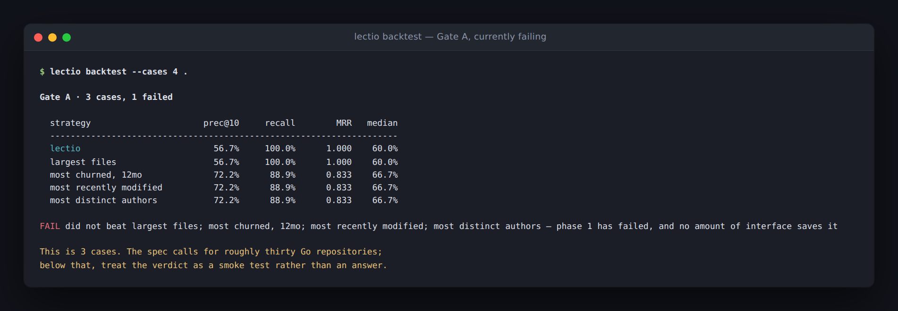

# Lectio

**Codebase orientation for new hires.** Point it at a repo you just joined. It
tells you what to read, in what order, and why — and later, where your
understanding is actually thin.


Three different signals lead those reasons: hidden coupling, orphaning,
centrality. A list where every row said the same thing would mean six of the
seven signals were decoration.

> **Status: unvalidated.** Gate A has not been run at scale. Every claim about
> ranking quality in this repository is a hypothesis until the backtest returns
> a number across roughly thirty repositories. See [Where this stands](#where-this-stands).

> Every screenshot below is a real run, captured from a terminal — against
> [go-git](https://github.com/go-git/go-git) (7,775 symbols, 36,615 call edges)
> unless noted. None of them are mockups, including the one that says FAIL.

## The one load-bearing rule

**The LLM never grades.** It may write question stems and one-line rationales.
Every correctness judgment comes from the call graph, the test suite, or git
history.

That constraint is structural, not aspirational. The only seam where a model
can be wired in is `probe.StemWriter`, which receives a symbol and returns a
string — it cannot see the expected answer set, cannot modify it, and runs
before grading exists. The type will not permit a phrasing, however creative,
to influence whether an answer is judged correct.

The same discipline shows up in the two call graphs. `View.Calls` includes
edges that class-hierarchy analysis over-approximated and drives ranking, where
a *possible* caller is still a reason to read something. `View.StaticCalls`
holds only edges the type checker proved and drives grading, so nobody is ever
marked wrong for failing to name a call no execution reaches.

You can read the same ground truth the grader does, and disagree with it:


The footer states its provenance, because a grader that cannot say why it
marked something wrong is one nobody will believe twice.

## What it is not

Not a metric product. A comprehension score exists internally to order the
reading path. It is never the headline, it is never displayed as a grade, and
it never leaves your machine. `lectio probe --forget` erases it in one command.

## Install

```sh
go install github.com/EzraStone/Lectio/cmd/lectio@latest
```

Requires Go 1.24+ and `git` on PATH. The binary is static — the SQLite driver
is pure Go, so there is no cgo and nothing to link.

```sh
cd ~/src/some-go-repo
lectio index .        # analyze; writes .lectio/index.db
lectio path .         # what to read, in what order, and why
```

Build `lectio` with a Go release at least as new as the repository you point it
at. The type checker is compiled in, so an older binary cannot type-check a
newer language version — it will index anyway, warn that packages failed, and
produce a call graph missing everything in them.

## Commands

| Command | What it does |
| --- | --- |
| `lectio index [repo]` | Analyze a repository and build its index |
| `lectio path [repo]` | Print a reading path, with a reason per item |
| `lectio deps <symbol> [repo]` | What breaks if you change this |
| `lectio probe [repo]` | Answer a question, graded against ground truth |
| `lectio backtest [repo...]` | Gate A: predict what a past newcomer touched |

Useful flags:

```sh
lectio path --task billing        # scope to the area you are working in
lectio path --explain             # show every signal's contribution
lectio path --json                # machine-readable, stdout stays clean
lectio deps parseInterval --uses  # what it depends on, instead
lectio index --run-tests          # map tests to symbols (executes repo code)
lectio probe --health             # is the probe design working?
lectio probe --forget             # erase all local history
```

The index lives in `.lectio/index.db` inside the repo. Add `.lectio/` to your
global gitignore.

## The seven signals

Each normalizes to [0,1] and is separable, so a ranking can be taken apart and
argued with — which is the only way to answer whether it is any good.

| Signal | Source | Why it matters |
| --- | --- | --- |
| Centrality | PageRank on the call graph | High fan-in means you can't avoid it |
| Churn | Commits touching the file, 12mo | Hot code is code you'll be asked to change |
| **Hidden coupling** | **Co-change minus static dependency** | **Files that change together without importing each other** |
| Fix density | Commits matching fix / bug / revert | Where the tricky semantics live |
| Orphaning | Lines whose author is 90d inactive | Nobody left to ask |
| AI density | git-ai notes and assistant trailers | Code that may never have been understood |
| Task proximity | Graph distance from a named area | Optional, user-supplied scope |

**Hidden coupling is the differentiator.** Centrality and churn are computable
by anyone and roughly match intuition. Co-change without a static dependency
surfaces what a senior engineer knows and cannot articulate: touch the
serializer, update the mobile schema.

Two guards carry most of its quality. Commits touching more than twenty files
are ignored — a reformat generates pairs quadratically while ordinary commits
generate a few. Strength is the Jaccard index, not a raw count, so a file that
changes constantly does not look coupled to everything it overlaps.

`--explain` opens up the arithmetic, which is the point of keeping the signals
separable — you cannot argue with a number you cannot decompose:


### Ordering is not ranking

Relevance decides *what* is on the list. Dependency depth decides *the order
you meet it in*, because you cannot understand a handler before its core types.
Results bucket into three relevance tiers, then sort by depth within each tier
— so depth has authority over items of comparable importance and none across
them. The top-scoring item is frequently not the first thing to read.

## Probes

Three types, all gradable without a judge.

- **Blast radius** — *You're changing `parseInterval`. What breaks?* Scored F1
  against the real dependent set plus covering tests. Subjects with fewer than
  two or more than twelve dependents are declined rather than asked badly.
- **Locate** — *Which function handles this?* Distractors come from the
  subject's own package, or the question is answerable by elimination.
- **Direction** — *Does `Scheduler` call `Queue`, or the reverse?* Catches an
  inverted mental model, which is what produces bad architecture decisions
  months later.


<sub>Lectio indexing itself. The grade is F1 against the call graph — no model
is involved in deciding whether that answer was right.</sub>

Firing rules: on first modification of a symbol not previously engaged, at most
three a day, seven-day cooldown per symbol, always skippable. **A skip is
neutral, never a failure** — it never touches the accuracy counters, so
skipping is never cheaper than answering.

`lectio probe --health` checks the spec's own stopping rule: if the median
answer time passes 30 seconds, the probe design is wrong. That is reported as a
defect in this tool, in those words.

## Where this stands

Phases 0 through 3 are built. Gate A runs but has not been run at scale.

A three-case smoke run against `gorilla/mux` currently reports **FAIL** — the
ranking does not beat the churn baseline there.



Three cases from one small repository is a smoke test, not an answer, and the
report says so itself below thirty cases. The weights have deliberately not
been tuned against it: with n=3, tuning would be fitting to noise, which is
precisely the failure mode the spec warns about.

Running Gate A properly is the next thing that matters. Nothing below it should
be built until it returns a number.

```sh
lectio backtest ~/corpus/*/     # roughly thirty Go repositories
```

### Known limitations

- **Go only.** The `LanguageAdapter` seam exists so a second language is one
  implementation of four methods, not a rewrite.
- **Analysis fidelity is capped by the Go version `lectio` was built with.**
  The type checker is compiled in, so a 1.24 binary rejects every package in a
  repo requiring 1.25 — on go-git that was the difference between 19,005 and
  36,615 call edges. It warns, but the warning does not yet name the fix.
- **Generated code is not detected.** Nobody onboards by reading generated
  protobuf, but it currently ranks like anything else.
- **Coverage is per test binary, not per test function.** Go writes one profile
  per binary; per-function attribution means re-running the suite once per test.
- **AI density depends on opt-in markers.** Absence means unknown, never human,
  and the signal stays silent rather than scoring low.
- **File-grained history signals.** Churn, fix density, orphaning and AI density
  are facts about a file, inherited by every symbol in it. Git cannot reliably
  tell us more at this granularity.

## Layout

| Path | What lives there |
| --- | --- |
| `internal/core` | Domain model — no Go, git, or SQL knowledge |
| `internal/adapter` | The `LanguageAdapter` seam |
| `internal/adapter/golang` | Symbols, call graph via type resolution + CHA, coverage |
| `internal/vcs` | Commit log, renames, author activity, AI markers |
| `internal/store` | SQLite index and local-only user state |
| `internal/graph` | PageRank, reachability, cycle-safe topological ordering |
| `internal/index` | Indexing pipeline and the read-side view |
| `internal/rank` | The seven signals, normalization, scoring, tiering |
| `internal/probe` | Probe generation and ground-truth grading |
| `internal/backtest` | Gate A and the hidden-coupling check |
| `internal/cli` | Command line |

See [ARCHITECTURE.md](ARCHITECTURE.md) for how the pieces fit and why.

## Development

```sh
make test     # go test ./...
make vet
make build    # bin/lectio
```

## License

MIT
